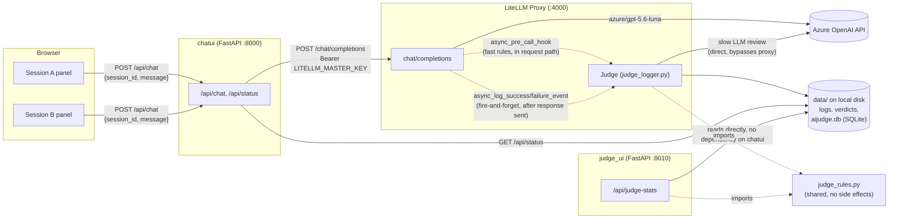
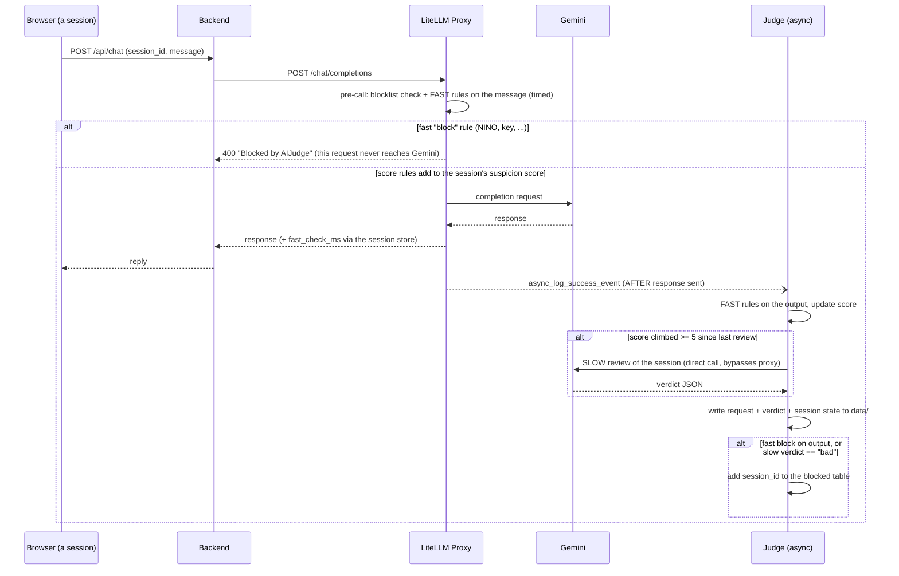

# AIJudge Architecture

This document explains how AIJudge is put together and, more importantly,
*why* — the decisions that shape it were mostly driven by one hard
requirement: **the AI part of the Judge must never add latency to a chat
call.** The deterministic fast rules do run in the request path, but they
are microsecond-scale regex and their cost is measured on every call (§3).
Almost every non-obvious design choice below traces back to that constraint.

## 1. System overview

Five processes/services, four of which you run locally:

- **Browser** — a static page with two independent chat panels (Session A /
  Session B), no build step.
- **Chat UI backend** (`chatui/backend/app.py`, FastAPI, `:8000`) — serves
  `chatui/frontend/` and is the only thing that talks to LiteLLM. Holds the
  only secret the browser never sees (`LITELLM_MASTER_KEY`).
- **LiteLLM proxy** (`litellm_proxy/`, `:4000`) — OpenAI-compatible proxy in
  front of Gemini. Runs the Judge as a registered callback inside the same
  process.
- **Judge Dashboard** (`judge_ui/app.py`, FastAPI, `:8010`) — a standalone
  admin/compliance view of what the Judge is doing. Deliberately
  independent of the chat UI backend (see §5) — reads `data/` directly and
  works with or without the chat UI running at all.
- **Gemini API** — the actual model provider, called both for user-facing
  chat (via the proxy) and by the Judge itself (directly, see §4).

The dotted lines into the Judge are deliberate: one is a hook that runs
*before* the call completes (the cheap deterministic fast rules), the other
fires *after* it already has (output rules, verdicts, and the LLM review). That split is the core of the whole design — see §3.
Note `judge_ui` has no arrow to or from `chatui` at all — that's
intentional, not an omission (see §5).

## 2. Components

| Component | File(s) | Responsibility |
|---|---|---|
| Frontend (chat UI) | `chatui/frontend/index.html`, `app.js`, `style.css` | Two `ChatPanel` instances, each owning its own client-generated session id; polls `/api/status` for shared judge activity; animates a request pipeline per panel; shows each session's fast-rule latency and suspicion score. |
| Chat UI backend | `chatui/backend/app.py` | Stateless proxy between browser and LiteLLM; adds the `Authorization` header the browser never sees; reads the session store to echo each request's fast-rule latency (`fast_check_ms`); exposes a lightweight `/api/status` (verdicts, blocklist, per-session summary) for its own sidebar. |
| LiteLLM proxy | `litellm_proxy/config.yaml` | Declares the `azure-gpt-5.6-luna` model and registers the Judge callback. |
| Judge | `litellm_proxy/judge_logger.py` | A `CustomLogger` callback: the fast tier in the pre-call hook (plus output rules post-call) and the slow LLM review post-call (see §3); writes the SQLite store (`data/aijudge.db`: sessions, stats, blocklist), logs and verdicts. |
| Shared rules | `judge_rules.py` (repo root) | Side-effect-free fast rules (regex + validators, actions and weights), the slow-review threshold and description — the single source of truth for what's actually enforced, read by both the Judge and the dashboard. |
| Judge Dashboard | `judge_ui/app.py`, `judge_ui/frontend/` | Standalone read-only view (plus the blocklist reset): fast and slow rules, fast-rule latency, per-session suspicion scores with a per-session drill-down (`/api/sessions/{id}`: exchanges, rule hits, judge prompts and replies), shadow-rule hit counts, verdict breakdown, token usage, unique sessions, requests/sec, blocklist. Independent process and port; no dependency on `chatui/`. |
| Red-team corpus | `tests/redteam_corpus.py`, `.github/workflows/redteam.yml` | Scores attack and benign prompts with the real fast-tier code against a per-case expectation; exits non-zero on a regression, and CI runs it. |
| Data store | `data/` (gitignored) | The only shared state across all three Python processes — one shared SQLite database (`aijudge.db`, WAL) via `judge_store.py`, plus per-exchange log/verdict files and a log file. |

## 3. The core design decision: a fast tier and a slow tier

The Judge is split by *cost and certainty*, and each tier runs at a different
point in the request lifecycle:

- **Fast** — deterministic rules (`judge_rules.FAST_RULES`): regex, plus a
  Luhn check. No AI. Input rules run in `async_pre_call_hook`, *in the
  request path, before the call reaches Gemini*, so a `block` rule stops the
  **current** request. A `score` rule instead adds points to the session's
  suspicion score (minor signal +1, major +5). Output rules run after the
  response has gone back, so they can only affect later turns.
- **Slow** — the LLM judge. Never run per exchange. When a session's score
  has climbed `SLOW_REVIEW_THRESHOLD` (5) since its last review, a
  background task (`asyncio.create_task`, *after* the response has gone back)
  has the LLM review the whole session: recent transcript plus the fast
  rules that fired. `bad` blocks the session, `safe` resets its score to 0,
  `suspicious` keeps the score and moves the review watermark, so another 5
  points are needed before the next review.

Why the LLM is gated by a score rather than "any regex match": regex can only
see shapes and phrases, not intent or a slow build-up over several turns.
The LLM can, but it's slow and costs tokens, so it's the second opinion you
pay for only once a session has accumulated enough weak evidence. One
ambiguous phrase ("system prompt") is +1; a clear one ("ignore previous
instructions") is +5 and triggers review alone.

**The fast tier's added latency is measured, not assumed.**
`async_pre_call_hook` times its own work with `time.perf_counter` — the
blocklist check (one indexed SQLite point read, so a dashboard reset is
seen immediately), the regex scan of the newest user message, and
the in-memory score update — and records it per session and globally
(the `sessions` table in `data/aijudge.db`; the chat backend echoes the per-request figure as
`fast_check_ms`, and both UIs show it). All file *writes* are deliberately
outside the measured window and off the request path: session state lives
in memory and is flushed to disk by a debounced timer (immediately, on a
rejection). In local testing the measured cost was roughly 0.05–0.2 ms per
request; expect it to grow with the number and complexity of rules and with
prompt length, which is why it is reported rather than assumed.

The consequence for the *slow* tier is unchanged and easy to expect wrong:
**a message that triggers a slow review still gets a completely normal
reply.** Only the session's *next* message is rejected, once the background
review has finished and updated the blocklist. Only a fast `block` rule can
stop the message in flight.

## 4. Judge internals

Per exchange, `_handle_event` (post-call) decides one of three paths, recorded
as `judge_path` on the verdict and counted in the stats document:

1. **`fast_block`** — a `block` rule fired (on the input, in the pre-call hook,
   which records that exchange itself; or on the output). "bad", no LLM. This
   is where the NINO compliance rule lives: deterministic, never left to the
   LLM's variance.
2. **`fast`** — no block and the session isn't due for review. Verdict
   "suspicious" if any score rule fired, else "safe" — where "safe" means
   *unreviewed*: no rule fired, the LLM never looked.
3. **`slow`** — this exchange pushed the session over the review threshold;
   `_slow_review` runs `_llm_judge` over the session transcript. It calls
   Gemini **directly** (`litellm.acompletion`, not through the local proxy),
   tagged with `metadata={"aijudge_internal": True}`, which `_handle_event`
   checks first thing and returns early on — this is what stops the Judge
   from recursively logging and judging its own judgment calls.

Fast-tier detail worth knowing: `_scan_fast` scans the raw text plus cheap in-memory
variants (`_text_variants`: Unicode-cleaned and homoglyph-folded text, de-spaced letters,
a leetspeak fold, rot13, and a bounded number of base64-decoded blobs) so trivial
obfuscation does not defeat the regexes; this is bounded and does no I/O, so it stays
inside the timed window. Rules flagged `shadow` are matched and recorded but never
block or score, which lets a new rule be trialled on real traffic first. The
`canary-leak` rule blocks any exchange containing the token planted in the chat
backend's system prompt.

The rubric explicitly judges **user intent, not assistant compliance**: a
prompt-injection attempt that the model successfully refuses is still
scored "bad", not "suspicious". This was a real bug found during testing —
the first version of the rubric let Gemini downgrade a clear injection
attempt to "suspicious" because the assistant happened to refuse it, so
nothing ever got blocked despite an obvious attack. Judging outcome instead
of intent means a persistent attacker who keeps getting refused never
crosses the blocking threshold.

A request from a session that is *already* on the blocklist is rejected in
the pre-call hook with the same "Blocked by AIJudge" error; it records a
latency sample but is not logged or counted as an exchange, and never
reaches `_handle_event`.

If the LLM judge itself returns empty content (most likely its own safety
filter balking at the content it's reviewing), that's treated as **"bad"**
by default — fail closed. A call that *errors* or returns unparseable JSON
is different: the verdict is "suspicious" but the review watermark is left
alone, so the next exchange retries the review.

## 5. Key architecture decisions

| Decision | Why | Tradeoff / consequence |
|---|---|---|
| The slow (LLM) tier is async, after the response is sent | Hard requirement: an LLM call must never add latency to a chat call | A slow review can never block the exchange that triggered it — only the next one from that session |
| Fast rules run in the pre-call hook, in the request path | Deterministic regex costs microseconds and lets a `block` rule stop the current request (e.g. a pasted secret) | It is added latency, however small — so it's measured on every call and reported per session on both UIs; store writes are kept out of it (the indexed blocklist read is not) |
| Judge calls Gemini directly, bypassing the local proxy | Avoid the Judge recursively logging/judging its own LLM-as-judge calls | Judge calls don't benefit from the proxy's own logging/retry config; guarded further by an explicit `aijudge_internal` flag |
| A per-session suspicion score gates the LLM, instead of "any regex match escalates" | Weak signals add up across turns, and the expensive LLM only runs once there's enough evidence (score climbed >= 5 since last review) | A novel attack matching no rule scores 0 and is never reviewed; exchanges no rule fired on are "safe" only in the sense of *unreviewed* |
| Slow review judges the session transcript, not one exchange | Catches a slow build-up of individually minor probes | The transcript is in-memory only (last 6 exchanges); a proxy restart forgets it, though scores persist |
| NINO (PII) rule is a fast `block` rule — deterministic, no LLM | Compliance rules shouldn't be subject to LLM variance | Intentionally over-flags — a non-NINO string that happens to match the shape still gets blocked |
| Rubric scores intent, not compliance | A refused attack attempt is still an attack attempt | None — this closed a real gap found in testing |
| Session identity is a client-generated id, not a cookie | Cookies are one-per-domain; can't run two independent sessions in one browser tab | Backend has zero server-side session state; a session is only as trustworthy as whatever the client sends |
| No Postgres / virtual-key DB for LiteLLM's built-in admin UI | Kept the whole system to one local SQLite file, no extra infra | LiteLLM's own `/ui` admin dashboard doesn't work (it requires a DB); not needed since our own UI + blocklist table cover the same need here |
| `AIJUDGE_DATA_DIR` is anchored to the repo root via `Path(__file__).resolve()` + the right number of `.parent`s in each of the three Python entry points | They run from different working directories and different folder depths (`litellm_proxy/`, `chatui/backend/`, `judge_ui/`); a naively relative path resolved to *different* folders with no error | Each file must recompute the right `.parent` chain for its own depth — don't copy one file's chain into another without checking it |
| Judge Dashboard is a fully separate service (own process, port, and codebase), not a route on the chat UI's backend | Explicit ask: it should work as a standalone admin/compliance tool, usable without the chat test UI running at all | Two FastAPI apps instead of one; `judge_rules.py` exists specifically so they don't duplicate (and drift on) what the rules actually are |

## 6. Data & storage

Everything the Judge sees and decides lives under `AIJUDGE_DATA_DIR`
(default `./data`, anchored to the repo root, gitignored):

- `data/logs/<uuid>.json` — every request/response pair
- `data/verdicts/<uuid>.json` — the Judge's verdict for that pair (read by
  the backend's `/api/status` for the "Recent Verdicts" panel)
- `data/aijudge.db` — SQLite in WAL mode, opened by all three processes
  through `judge_store.py` (the only code that knows the schema). Pre-SQLite
  `blocked_users.json` / `sessions.json` / `stats.json` are imported once and
  renamed `*.migrated`. Tables:
  - `blocked` — blocked session ids (written by the Judge and cleared by the
    dashboard's reset; read by the Judge's pre-call hook, `/api/status`, and
    `/api/judge-stats`)
  - `sessions` — per-session suspicion score, review watermark, recent
    fast-rule hits, last few slow reviews and fast-rule latency. Written by
    the Judge (debounced; only changed rows); read by `chatui/backend/app.py`
    and `judge_ui/app.py`
  - `kv` — the global fast-rule latency block (total/max and the last 200
    samples), the slow-review threshold, and the running-stats document
    (request count, verdict breakdown, token usage split chat vs judge,
    `judge_paths`, unique sessions, rolling request timestamps), which only
    the Judge writes and only the dashboard reads
- `data/judge_activity.log` — human-readable trace of every exchange, every
  prompt sent to the LLM judge, its raw response, and the final verdict
  (also mirrored to the LiteLLM proxy's console)
SQLite serialises writers, and `update_stats` runs as a read-modify-write
inside `BEGIN IMMEDIATE`, so stats updates are safe across processes as well
as asyncio tasks (no more "no `await` between read and write" caveat). Many
readers never block the writer (WAL). The Judge still keeps the session state
in memory and flushes it off the request path.

## 7. Known limitations

- The fast rules are a small, illustrative pattern list — novel attacks
  that match nothing in it score 0 and are never reviewed by the LLM.
  Exchanges no rule fired on are marked "safe" but really mean *unreviewed*.
- Blocking is per client-chosen session id, not per-IP or per-account —
  there's no auth layer. This is a local testing setup, not a hardened
  multi-tenant deployment.
- The NINO check is shape-based and will false-positive on non-NINO strings
  that happen to fit the pattern — an accepted tradeoff for PII handling.
- LLM-as-judge verdicts are still probabilistic where they're used (the
  slow tier) — the hard `block` rules (NINO, secrets) and the intent-based
  rubric narrow, but don't eliminate, that variance.
- Output-side fast rules run after the response is sent, so they can only
  affect the session's later turns.
- The fast tier is regex, so it is beatable by rewording, obfuscation
  (leetspeak, homoglyphs, encodings), other languages and fictional framing.
  Input normalisation covers common encodings, but not other languages,
  fictional framing or low-and-slow multi-turn probing. Run
  `tests/redteam_corpus.py` to see, for the current rules, which
  public-technique prompts are caught and which slip through.
- The dashboard's session drill-down reads the judge's prompt and reply from the tail
  of `judge_activity.log` and scans verdict files per request; fine here, but it would
  need an index by session at volume.
